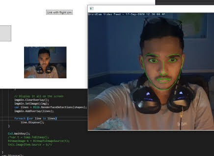

# CVHeadTrack
Custom made, Computer Vision based head tracking software made using OpenCV, DLib and OpenTrack to communicate with game.

I chose C# so I can learn .NET and WPF. Had to do with wrapper libraries for OpenCV and DLib but it does the job. 

## Progress

Prototype complete, tested on <a href="https://store.steampowered.com/app/359320/Elite_Dangerous/">Elite Dangerous</a>, need to do a lot of optimization, clean up the code and make the tracker overall smoother. 

The core elements have been implemented where:
OpenCV captures frames from webcame/DroidCam url. Dlib model used to extract face landmarks. OpenCV used again to projected into 3D space then the head yaw calculated from the rotational matrix. This data is send to the OpenTrack input UPD socket. Need to experiment with other method to possible improve this.

## Left to do:
1. Use less features landmark model for face (Immediate)
2. Try lower resolution images to speed up
3. Write function to smooth out camera motion
4. Thread code where possible?
5. Use GPU for image calculations?
6. Add x,y,x tracking. (Currently only yaw) 
7. Variable output port

## Demo

Will add more after testing

I did originally want to use  SimConnect API, waiting on flight sim developers to fix/implement CameraRelative6DOF function. Guess publishers don't care about dev kits.

# References:

## OpenTrack
Nice software to support head tracking in a large variety of games
Has a UPD port which listens for the head tracking data then it translates to which ever game the user wants
https://github.com/opentrack/opentrack

## Face model
Open source model from http://dlib.net/files/. Could look into using a lighter weight one to improve performance.

## Modules used
1. DlibDotNet (face nn)
2. OpenCvSharp (to read from ip camera) - shouldn't need if you afford a real webcam

## Bib
* C# Facial landmarks:
https://medium.com/machinelearningadvantage/detect-facial-landmark-points-with-c-and-dlib-in-only-50-lines-of-code-71ab59f8873f
* Read from opencv wrapper to dlib
https://github.com/takuya-takeuchi/DlibDotNet/blob/master/examples/WebcamFacePose/Program.cs
* OpenCv 2d->3d point projection
https://medium.com/analytics-vidhya/real-time-head-pose-estimation-with-opencv-and-dlib-e8dc10d62078
* Get yaw, pitch and roll from rotational matrix
http://planning.cs.uiuc.edu/node103.html